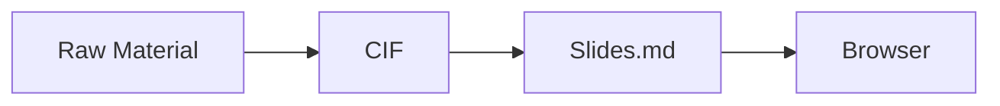

# Phase 3/5 Implementation Tickets

> Implementation specifications for Sonnet-class agents.  
> Each ticket is self-contained: background, acceptance criteria, file paths, dependencies, and testing approach.

---

## TICKET-01: Visual Enrichment Skill

**File**: `skills/visual-enrichment/SKILL.md`  
**Type**: Skill (user-invoked)  
**Priority**: High — most user-visible improvement over raw authoring  
**Dependencies**: Authoring skill (must exist), CIF schema

### Background

After the authoring skill generates a CIF, slides contain only text. The visual enrichment skill analyzes each slide's content and proposes the best visual treatment — Mermaid diagrams, code blocks, data tables, or image placeholders. It then modifies the CIF to include the visual, and re-renders.

Slidev natively supports Mermaid (via fenced code blocks with `mermaid` language), code highlighting (Shiki), and LaTeX/KaTeX. Vue components in the theme can render anything else.

### Specification

**Trigger phrases**: "add visuals", "suggest diagrams", "enrich slides", "add charts", "visualize", "make it visual", "add diagrams"

**Input**: A workspace with a populated `.slidecraft/cif.json`

**Pipeline**:

1. **Read the CIF** and for each slide, classify its content type:
   - `process` → flowchart or sequence diagram (Mermaid)
   - `comparison` → table or side-by-side layout
   - `data/numbers` → chart (Mermaid pie/bar, or inline HTML table)
   - `hierarchy` → mind map (Mermaid mindmap) or tree
   - `timeline` → Mermaid timeline or Gantt
   - `code` → syntax-highlighted code block
   - `concept` → simple illustration placeholder or icon grid
   - `quote` → no visual needed, leave as-is
   - `narrative` → no visual needed, leave as-is

2. **Generate a proposal table** showing each slide and the recommended visual:
   ```
   Slide 03 [default] "Three risks threaten launch" → Mermaid flowchart (risk → impact → mitigation)
   Slide 05 [two-cols] "Revenue grew 40% YoY"       → Mermaid bar chart (quarterly breakdown)
   Slide 07 [default] "The deployment pipeline"      → Mermaid sequence diagram
   ```
   Present this to the user for approval. User can accept all, reject individual items, or modify.

3. **For each approved visual**, generate the Mermaid/code content:
   - Mermaid diagrams: generate valid Mermaid syntax, wrap in ````mermaid` fenced block
   - Code blocks: extract or generate code, wrap in fenced block with language tag
   - Tables: generate markdown table
   - All visuals go into the slide's `content` field in the CIF, replacing or augmenting text

4. **Apply cognitive load limits** from `references/best-practices.md`:
   - Max 7-9 nodes per Mermaid diagram
   - Max 5 rows in a table (on slides — more in handout mode)
   - Max 15 lines of code per code block
   - If content exceeds limits, split across slides or simplify

5. **Save history** (copy current CIF to `.slidecraft/history/`) then write updated CIF

6. **Re-render** using `scripts/render-cif.py`

### Mermaid Integration Details

Slidev renders Mermaid natively. In `slides.md`, a Mermaid diagram looks like:

````markdown

````

In the CIF, store this in the slide's `content` field as a regular string with the fenced code block included.

The IU theme should style Mermaid diagrams to use brand colors. Add a `setup/mermaid.ts` file to the theme:

```typescript
import { defineMermaidSetup } from '@slidev/types'

export default defineMermaidSetup(() => ({
  theme: 'base',
  themeVariables: {
    primaryColor: '#0BF000',
    primaryTextColor: '#1D1D1F',
    primaryBorderColor: '#575E62',
    lineColor: '#575E62',
    secondaryColor: '#E0E0E3',
    tertiaryColor: '#FFFFFF',
    fontFamily: 'Source Sans 3, Source Sans Pro, system-ui, sans-serif',
  },
}))
```

### Acceptance Criteria

- [ ] Skill reads CIF, classifies each slide, proposes visuals
- [ ] User can approve/reject/modify proposals before changes are made
- [ ] Generates valid Mermaid syntax for at least: flowchart, sequence, mindmap, pie, timeline
- [ ] Generates markdown tables for comparison data
- [ ] Applies cognitive load limits (max nodes, max rows)
- [ ] Saves CIF history before modification
- [ ] Re-renders slides.md after CIF update
- [ ] Mermaid diagrams render in Slidev with IU brand colors (setup/mermaid.ts)

### Testing

Create a test CIF with 8 slides covering each content type. Run the skill and verify:
1. All Mermaid diagrams parse without errors (validate syntax)
2. Node counts stay within limits
3. `slides.md` renders in Slidev without errors
4. Visual proposals match content type classification

---

## TICKET-02: Content Reviewer Agent

**File**: `agents/content-reviewer.md`  
**Type**: Agent (invoked by orchestrator or user)  
**Priority**: High — quality gate before final output  
**Dependencies**: CIF schema, `references/best-practices.md`

### Background

The content reviewer is a quality-assurance agent that evaluates a completed CIF against presentation best practices. It produces a structured review with pass/fail scores and specific fix suggestions. It does NOT make changes — it produces a review report that the authoring skill or user acts on.

### Specification

**Agent description**: "Reviews slide deck content for completeness, logical flow, audience fit, and design compliance"

**Input**: Path to `.slidecraft/cif.json` and optionally a brief (from `assets/brief.md` or user instructions)

**Review dimensions** (each scored 1-5):

1. **Structural completeness**
   - Does the deck have an opening hook?
   - Is there a clear problem/context framing?
   - Does each section have a section divider?
   - Is there a conclusion or call to action?
   - Does the deck end with contact/thank-you?

2. **Narrative flow**
   - Do slides follow a logical sequence?
   - Are transitions between slides smooth? (check if slide N's content naturally leads to slide N+1)
   - Is there a single coherent thread (not jumping between unrelated topics)?
   - Is the pacing appropriate? (not too many slides on one point, not rushing through another)

3. **Title quality**
   - Are titles assertion-style? (statement, not topic label)
   - Score: count of assertion titles / total titles
   - Flag any topic-label titles: "Overview", "Summary", "Results", "Next Steps" without a claim

4. **Information density**
   - Word count per slide (flag if > 40 words body text)
   - Bullet count per slide (flag if > 6)
   - Consecutive same-layout count (flag if > 4 in a row)

5. **Speaker notes quality**
   - Are notes present on every slide?
   - Are notes different from slide text? (flag if >60% overlap with body content)
   - Are notes long enough to be useful? (flag if < 30 words)
   - Do notes include transition cues?

6. **Brief compliance** (if brief available)
   - Does the deck address the target audience?
   - Does it cover the key message stated in the brief?
   - Is the tone appropriate?

**Output format**: A JSON review object:

```json
{
  "overallScore": 4.2,
  "dimensions": {
    "structure": { "score": 5, "issues": [] },
    "flow": { "score": 4, "issues": ["Slide 7→8 jumps from pricing to technical architecture without transition"] },
    "titles": { "score": 3, "issues": ["Slide 4: 'Overview' is a topic label, not an assertion", "Slide 12: 'Next Steps' — rewrite as specific action"] },
    "density": { "score": 4, "issues": ["Slide 9: 52 words exceeds 40-word limit"] },
    "notes": { "score": 5, "issues": [] },
    "briefCompliance": { "score": 4, "issues": ["Brief mentions 'cost savings' but no slide quantifies savings"] }
  },
  "summary": "Strong deck with good structure. Main issues: 2 topic-label titles and one dense slide. Flow break between slides 7-8 needs a transition slide or reordering.",
  "suggestions": [
    { "slideId": "slide-04", "action": "retitle", "current": "Overview", "suggested": "Three capabilities set us apart from competitors" },
    { "slideId": "slide-09", "action": "split", "reason": "52 words — split into two slides: one for the problem, one for the solution" },
    { "slideId": "slide-07", "action": "add_transition", "reason": "Insert section divider before technical deep-dive" }
  ]
}
```

The agent writes this review to `.slidecraft/review.json` and presents a human-readable summary.

### Acceptance Criteria

- [ ] Scores all 6 dimensions (5 if no brief)
- [ ] Identifies all topic-label titles (non-assertion)
- [ ] Counts words and bullets per slide, flags violations
- [ ] Detects consecutive same-layout runs > 4
- [ ] Checks speaker notes presence, length, and overlap with body
- [ ] Produces actionable suggestions with slide IDs and specific rewrites
- [ ] Writes review to `.slidecraft/review.json`
- [ ] Does NOT modify the CIF — review only

### Testing

Create two test CIFs: one "good" deck (should score >4.0) and one "bad" deck with intentional issues (topic-label titles, missing notes, wall-of-text slides, layout monotony). Verify the agent correctly identifies all planted issues.

---

## TICKET-03: Anti-Slop Agent

**File**: `agents/anti-slop.md`  
**Type**: Agent (invoked by orchestrator or on demand)  
**Priority**: High — core differentiator vs. generic AI slides  
**Dependencies**: CIF schema

### Background

AI-generated presentations tend to be generic, buzzword-laden, and interchangeable. The anti-slop agent is a specialized detector that flags (and optionally rewrites) content that falls into these patterns. It is the single most important quality differentiator for slidecraft.

### Specification

**Agent description**: "Detects and removes generic filler, cliches, buzzwords, and stock-photo-energy from slide content"

**Input**: Path to `.slidecraft/cif.json`

**Detection categories**:

1. **Buzzword density** — Flag slides where >20% of content words are from the blocklist:
   ```
   delve, leverage, synergy, transformative, paradigm, holistic, robust,
   scalable, innovative, cutting-edge, game-changing, best-in-class,
   state-of-the-art, next-generation, world-class, disruptive, empower,
   unlock, harness, streamline, optimize, seamless, actionable, impactful,
   ecosystem, landscape, journey, deep dive, move the needle, circle back,
   low-hanging fruit, boil the ocean, north star, at the end of the day,
   it goes without saying, in today's fast-paced world, in conclusion,
   without further ado, as we all know
   ```

2. **Topic-label titles** — Titles that are just nouns or noun phrases without a verb or claim:
   - Bad: "Introduction", "Background", "Results", "Summary", "Key Takeaways"
   - Good: "Solar adoption tripled in emerging markets", "Three risks threaten the Q3 launch"
   - Heuristic: flag titles with <4 words, titles that are a single noun/noun-phrase, titles without a verb

3. **Interchangeability test** — For each slide, ask: "Could this exact text appear in any other presentation on any topic?" If yes, it's slop.
   - Flag phrases like "We are committed to excellence", "Our team is passionate about...", "We believe in the power of..."
   - Flag any sentence that could be true of literally any company or project

4. **Empty calories** — Filler that adds no information:
   - "It's important to note that..." → just state the thing
   - "As mentioned earlier..." → remove or restate clearly
   - "There are several key factors..." → list the factors
   - Sentences with no specific nouns, numbers, or claims

5. **Weasel words** — Vague quantifiers that avoid commitment:
   - "significant", "substantial", "considerable", "various", "numerous", "many"
   - Flag only when no specific number follows (e.g., "significant growth" is slop, "significant — 340% — growth" is fine)

6. **Stock-photo-energy** — Flag visual suggestions or descriptions that suggest generic stock imagery:
   - "diverse team collaborating", "person pointing at screen", "handshake", "lightbulb moment"
   - This applies to any image descriptions in the CIF, not to actual images

**Output format**: Similar to content-reviewer but focused on slop:

```json
{
  "slopScore": 0.23,
  "totalFlags": 12,
  "slides": [
    {
      "slideId": "slide-03",
      "flags": [
        { "type": "buzzword", "text": "leverage our cutting-edge platform", "suggestion": "use [specific platform name]" },
        { "type": "interchangeable", "text": "We are committed to delivering value", "suggestion": "Delete — or state what specific value, for whom" }
      ]
    }
  ],
  "summary": "23% slop density. Main offenders: slides 3, 7, 11. Most common issue: buzzword clusters in slide bodies."
}
```

**Optional rewrite mode**: If invoked with `--fix` or user says "fix the slop", the agent rewrites flagged content with specific, concrete alternatives and updates the CIF (after saving history).

### Implementation Notes

- The blocklist should be stored as a JSON file at `references/slop-blocklist.json` so it can be extended
- The agent should work on the CIF's `title`, `content`, `slots`, and `notes` fields
- Scoring: `slopScore` = total flagged words / total content words across all slides
- A slopScore > 0.15 should trigger a warning; > 0.25 should block rendering until fixed

### Acceptance Criteria

- [ ] Detects all 6 categories of slop
- [ ] Produces per-slide flags with specific text excerpts and suggestions
- [ ] Calculates overall slop score
- [ ] Optional rewrite mode updates CIF with concrete alternatives
- [ ] Saves history before any CIF modifications
- [ ] Blocklist is externalized to `references/slop-blocklist.json`
- [ ] Never introduces new slop in rewrites (self-check)

### Testing

Create a deliberately sloppy CIF full of buzzwords and generic filler. Run the agent and verify every planted issue is caught. Then run in rewrite mode and verify the output has a significantly lower slop score (<0.10).

---

## TICKET-04: Layout & Style Agent

**File**: `agents/layout-style.md`  
**Type**: Agent (invoked by orchestrator after authoring)  
**Priority**: Medium — polish layer  
**Dependencies**: CIF schema, theme manifest (`theme-manifest.json`), `references/best-practices.md`

### Background

The layout & style agent reviews and optimizes layout choices across the entire deck. It catches layout monotony (too many `default` slides in a row), suggests better layout fits for specific content, and ensures visual rhythm.

### Specification

**Agent description**: "Optimizes slide layout selection, visual rhythm, and theme compliance across the deck"

**Input**: Path to `.slidecraft/cif.json` and optionally the theme's `theme-manifest.json`

**Analysis tasks**:

1. **Layout monotony detection**
   - Flag runs of >3 consecutive slides with the same layout
   - Suggest breaking monotony with section dividers, quote slides, or fact slides
   - Exception: the first and last slides (cover/end) are exempt

2. **Layout-content mismatch**
   - A slide with two parallel lists should use `two-cols`, not `default`
   - A slide with a single bold statement should use `fact` or `accent`, not `default`
   - A slide with a quote should use `quote`
   - A slide with only a heading and subtitle should use `section`, not `default` with sparse content
   - A "thank you" or closing slide should use `end`

3. **Visual rhythm scoring**
   - Map each layout to a visual "weight": cover=5, section=4, fact=4, accent=4, quote=3, two-cols=2, default=1, end=5
   - Plot the weight sequence and flag if it's flat (all 1s = no visual variety) or chaotic (random jumps)
   - Ideal: gradual escalation with periodic peaks at section breaks

4. **Deck structure validation**
   - First slide should be `cover`
   - Last slide should be `end`
   - Section breaks should appear every 4-7 content slides
   - No orphan slides (a single content slide between two section breaks)

5. **Available layouts awareness**
   - Read the theme's available layouts from the `layouts/` directory
   - Only suggest layouts that actually exist in the theme
   - If the theme has specialty layouts (e.g., `fact`, `accent`, `side-note`), prefer them over generic `default`

**Output format**:

```json
{
  "rhythmScore": 3.5,
  "monotonyRuns": [
    { "start": "slide-04", "end": "slide-08", "layout": "default", "suggestion": "Insert a section or fact slide at slide-06" }
  ],
  "mismatches": [
    { "slideId": "slide-05", "current": "default", "suggested": "two-cols", "reason": "Content has two parallel bullet lists" }
  ],
  "structureIssues": [
    "No section break between slides 04-12 (8 content slides without a divider)"
  ]
}
```

The agent writes this to `.slidecraft/layout-review.json`. Optionally, with `--fix` mode, it applies the suggested layout changes to the CIF.

### Acceptance Criteria

- [ ] Detects layout monotony (>3 same consecutive)
- [ ] Identifies layout-content mismatches for at least: two-cols, quote, fact, section
- [ ] Computes visual rhythm score
- [ ] Validates deck structure (cover first, end last, section break frequency)
- [ ] Only suggests layouts available in the current theme
- [ ] Optional fix mode applies changes to CIF (with history save)
- [ ] Writes analysis to `.slidecraft/layout-review.json`

### Testing

Create a test CIF with 15 slides all using `default` layout, including content that clearly fits other layouts. Verify the agent flags monotony and suggests correct layout alternatives.

---

## TICKET-05: Narrative Agent

**File**: `agents/narrative.md`  
**Type**: Agent (invoked by orchestrator during drafting, or on-demand)  
**Priority**: Medium — elevates raw bullets into storytelling  
**Dependencies**: CIF schema, `references/best-practices.md`

### Background

The narrative agent transforms flat, bullet-point-heavy slide content into a compelling story arc. It operates on the CIF to improve transitions, add narrative connectors between slides, strengthen opening hooks, and ensure the deck has emotional momentum — not just information.

### Specification

**Agent description**: "Transforms flat bullet content into compelling narrative arcs with hooks, transitions, and emotional momentum"

**Input**: Path to `.slidecraft/cif.json`

**Tasks**:

1. **Story arc analysis**
   - Map the current deck to a narrative structure: Setup → Conflict → Rising Action → Climax → Resolution
   - Identify which slides serve which narrative function
   - Flag decks that are purely informational with no tension or arc ("list of facts" pattern)

2. **Opening hook evaluation**
   - Does slide 1 or 2 contain a hook? (surprising statistic, provocative question, bold claim, relevant anecdote)
   - If not, suggest a hook based on the deck's content
   - Hook types: statistical surprise, contrarian claim, question, micro-story, future-state visualization

3. **Transition generation**
   - For each pair of adjacent slides, evaluate the transition quality
   - Add transition phrases to the end of speaker notes: "Now that we've seen X, let's look at Y" or "This raises the question..."
   - Flag abrupt topic changes where a bridge slide might help

4. **Narrative connectors**
   - Add "callback" references to earlier slides: "Remember the 40% growth we saw? Here's what's driving it."
   - Add "foreshadowing" to early slides: "We'll see in a moment why this matters."
   - These go into speaker notes, not slide body text

5. **Emotional momentum mapping**
   - Map each slide's emotional register: neutral, urgent, hopeful, concerning, exciting, reflective
   - Flag sequences that are monotonically neutral (no emotional peaks)
   - Suggest where to add emphasis slides (fact, accent) to create peaks

6. **Call-to-action strength**
   - Evaluate the closing slides: is the CTA specific and actionable?
   - "Contact us" is weak; "Schedule a 15-minute demo this week" is strong
   - Suggest a stronger CTA if needed

**Output format**:

```json
{
  "arcType": "problem-solution",
  "arcScore": 3.8,
  "hookPresent": false,
  "hookSuggestion": "Open with: 'Last year, 73% of enterprise presentations were never opened again. Here's how to be in the other 27%.'",
  "transitionGaps": [
    { "from": "slide-05", "to": "slide-06", "issue": "Jumps from cost analysis to team structure", "suggestion": "Add transition in slide-05 notes: 'These costs are why our team is structured the way it is.'" }
  ],
  "emotionalMap": ["exciting", "neutral", "neutral", "neutral", "neutral", "neutral", "neutral", "neutral", "hopeful"],
  "emotionalIssues": ["Slides 02-08 are uniformly neutral — add a 'fact' slide at position 5 to create a peak"],
  "ctaStrength": "weak",
  "ctaSuggestion": "Replace 'Thank you' with 'Book your pilot: calendly.com/demo — first 10 teams get priority onboarding'"
}
```

The agent writes this to `.slidecraft/narrative-review.json`. With `--fix` mode, it modifies speaker notes and optionally adds hook/bridge slides to the CIF.

### Acceptance Criteria

- [ ] Classifies story arc type (problem-solution, chronological, comparison, etc.)
- [ ] Evaluates opening hook presence and suggests one if missing
- [ ] Generates transition text for speaker notes between every slide pair
- [ ] Maps emotional register per slide and flags flat sequences
- [ ] Evaluates CTA strength and suggests improvements
- [ ] Fix mode updates speaker notes and optionally adds slides
- [ ] Writes analysis to `.slidecraft/narrative-review.json`
- [ ] All modifications go through CIF (never edits slides.md)

### Testing

Create a flat, bullet-heavy CIF with no hook, no transitions, and a weak CTA. Run the agent and verify it identifies all issues. Run in fix mode and verify speaker notes are enriched with transitions and callbacks.

---

## TICKET-06: Interactive Editing Skill

**File**: `skills/interactive-editing/SKILL.md`  
**Type**: Skill (user-invoked)  
**Priority**: High — core UX for iterative refinement  
**Dependencies**: CIF schema, `scripts/render-cif.py`, all review agents

### Background

The interactive editing skill provides a conversational interface for modifying presentations after initial authoring. It's the "edit loop" extracted from the authoring skill into a standalone, richer experience. It handles natural language edit commands, orchestrates review agents, and manages the edit-render-review cycle.

### Specification

**Trigger phrases**: "edit slides", "change slide", "update presentation", "modify deck", "review and edit", "polish slides", "improve presentation", "iterate on slides"

**Input**: A workspace with a populated `.slidecraft/cif.json` and `slides.md`

**Capabilities**:

1. **Show deck overview**
   - Display numbered list of all slides with layout and title
   - Show overall stats: slide count, estimated duration (1 slide/min), theme name

2. **Single-slide operations**
   - `change slide N` → ask what to change, update CIF, re-render
   - `show slide N` → display full content, notes, layout, and visual type
   - `rewrite slide N` → regenerate content for that slide from scratch
   - `delete slide N` → remove from CIF, renumber, re-render
   - `move slide N to position M` → reorder in CIF array
   - `change layout of slide N to X` → update layout field
   - `add notes to slide N` → update or append speaker notes

3. **Multi-slide operations**
   - `add a slide about X after slide N` → generate new slide, insert at position
   - `add a section break before slide N` → insert section slide
   - `swap slides N and M` → exchange positions
   - `split slide N` → divide into two slides if content is too dense
   - `merge slides N and M` → combine content into one slide

4. **Deck-level operations**
   - `run review` → invoke content-reviewer agent, display results
   - `check for slop` → invoke anti-slop agent, display results
   - `fix layout` → invoke layout-style agent in fix mode
   - `improve narrative` → invoke narrative agent in fix mode
   - `add visuals` → invoke visual-enrichment skill
   - `full polish` → run all agents in sequence: narrative → layout → anti-slop → content-review

5. **Undo / History**
   - `undo` → restore the most recent CIF from `.slidecraft/history/`
   - `show history` → list all saved versions with timestamps
   - `restore version YYYYMMDD-HHMMSS` → restore a specific version

### Edit workflow

For every edit operation:
1. Save current CIF to `.slidecraft/history/cif-YYYYMMDD-HHMMSS.json`
2. Apply the edit to `.slidecraft/cif.json`
3. Re-render `slides.md` using `scripts/render-cif.py`
4. Confirm the change to the user with a brief summary
5. If the Slidev dev server is running, the browser auto-refreshes via Vite HMR

### The `full polish` pipeline

When user says "polish", "improve", or "full polish", run this sequence:
1. Narrative agent (adds hooks, transitions, strengthens CTA) — fix mode
2. Layout/style agent (fixes monotony, mismatches) — fix mode
3. Anti-slop agent (removes buzzwords, genericisms) — fix mode
4. Content reviewer (final quality check) — review-only mode
5. Present the content review results to the user
6. Ask if they want to apply any of the review suggestions

### Acceptance Criteria

- [ ] All single-slide operations work (change, show, rewrite, delete, move, layout, notes)
- [ ] All multi-slide operations work (add, section break, swap, split, merge)
- [ ] All deck-level operations work (run each agent/skill)
- [ ] Full polish pipeline runs agents in correct order
- [ ] Undo restores previous CIF version
- [ ] History browsing works
- [ ] Every edit saves to history before applying
- [ ] Every edit triggers re-render
- [ ] Natural language parsing handles reasonable variations of commands

### Testing

Start with the hello-world deck. Execute each operation type and verify:
1. CIF is correctly modified
2. History entry is created
3. slides.md is re-rendered
4. Undo restores the previous state
5. Full polish pipeline runs without errors

---

## Implementation Order

Recommended sequence for implementation:

1. **Anti-slop agent** (TICKET-03) — smallest scope, pure text analysis, no external deps
2. **Content reviewer agent** (TICKET-02) — builds on best-practices reference, pure analysis
3. **Layout & style agent** (TICKET-04) — needs theme layout awareness
4. **Narrative agent** (TICKET-05) — most creative, benefits from having other agents to reference
5. **Visual enrichment skill** (TICKET-01) — needs Mermaid setup, theme integration
6. **Interactive editing skill** (TICKET-06) — orchestrator, needs all agents working first

Each agent can be developed and tested independently. The interactive editing skill is the integration layer that ties them together.

---

## Shared Infrastructure

All agents and skills share:

- **CIF schema**: `references/cif-schema.md` — the JSON structure for slide data
- **Best practices**: `references/best-practices.md` — scoring thresholds and rules
- **Renderer**: `scripts/render-cif.py` — CIF → slides.md conversion
- **History pattern**: save to `.slidecraft/history/cif-YYYYMMDD-HHMMSS.json` before any CIF write
- **Output pattern**: reviews go to `.slidecraft/<agent-name>-review.json`

### Plugin registration

Each new skill needs a directory under `skills/` with a `SKILL.md`.  
Each new agent needs a file under `agents/` with a `.md` extension.  
The plugin's `plugin.json` already points to `./skills` and implicitly to `./agents`.
