# Visual Enrichment Skill

You analyze a slide deck's CIF, classify every slide's content type, propose a visual treatment for each slide that benefits from one, generate the visual content (Mermaid diagrams, tables, code blocks, or placeholders), enforce cognitive-load limits, and write the updated CIF back to disk before re-rendering.

Before starting, read `references/best-practices.md` for design rules and apply them throughout.

---

## Step 1 — Read the CIF and Classify Each Slide

Read `.slidecraft/cif.json`. For every slide, examine the `title`, `content`, `layout`, and `slots` fields together and assign one content type from the table below.

### Content-Type Classification

| Content Type | Signals in Slide Text | Recommended Visual |
|---|---|---|
| `process` | Steps, "then", "next", "after", "workflow", "pipeline", ordered list | Mermaid `flowchart` or `sequenceDiagram` |
| `comparison` | "vs.", "versus", "compared to", "before/after", two-cols layout, pros/cons | Mermaid `block` table or layout `two-cols` with structured markdown table |
| `data` | Numbers, percentages, growth figures, survey results, statistics | Mermaid `pie` or `xychart-beta` |
| `hierarchy` | "levels", "team", "structure", "taxonomy", "categories", indented list | Mermaid `mindmap` or `graph TD` tree |
| `timeline` | Dates, "since", "by Q3", "roadmap", "phase 1/2/3", "milestones" | Mermaid `timeline` or `gantt` |
| `code` | Code snippets, function names, CLI commands, config examples, backtick content | Fenced code block with language identifier |
| `concept` | Abstract ideas, definitions, single-term explanations, no data | Image placeholder with descriptive alt text |
| `quote` | Pull quote, testimonial, attributed statement, `quote` layout | No visual needed — the text is the visual |
| `narrative` | Continuous prose, story, background context, no discrete elements | No visual needed |

**Classification heuristics — apply in order:**

1. If `layout` is `quote` → assign `quote`. Stop.
2. If `content` contains a fenced code block (` ``` `) or inline code of >10 characters → assign `code`. Stop.
3. If `content` or `title` contains ISO dates, quarters, phase numbers, or the word "roadmap" → assign `timeline`. Stop.
4. If `content` contains a list where items begin with digits or percentages (e.g. "42%", "3x") → assign `data`. Stop.
5. If `layout` is `two-cols` OR title/content uses comparison language ("before", "after", "vs.", "while") → assign `comparison`. Stop.
6. If `content` contains words like "step", "then", "next", "following", "pipeline", or an ordered list (1., 2., 3.) → assign `process`. Stop.
7. If `content` or `title` contains "team", "department", "reports to", "levels", or a deeply nested list → assign `hierarchy`. Stop.
8. If title is a single abstract noun or the slide defines a term → assign `concept`. Stop.
9. If `content` is long prose (>60 words) with no list structure → assign `narrative`. Stop.
10. Default → assign `narrative`.

**Skip list:** Do not propose visuals for slides with these layouts: `cover`, `section`, `section-gray`, `end`, `divider`, `accent`. Mark them as `skip`.

---

## Step 2 — Build and Present the Proposal Table

After classifying every slide, build a proposal table and present it to the user **before generating any visual content**.

Format:

```
Visual Enrichment Proposals
============================

Slide | Title (truncated)                          | Type        | Proposed Visual
------|-------------------------------------------|-------------|------------------------------------------
01    | [cover] Why Slidecraft Saves Time          | skip        | —
02    | [section] The Problem                      | skip        | —
03    | Manual formatting wastes 3 h per deck      | data        | Mermaid pie — time breakdown
04    | CIF separates content from presentation    | comparison  | Retain two-cols, add markdown table
05    | Rendering pipeline runs in three steps     | process     | Mermaid flowchart LR (3 nodes)
06    | Team structure: four squads                | hierarchy   | Mermaid mindmap (4 leaf nodes)
07    | Milestones for Q3 delivery                 | timeline    | Mermaid timeline
08    | Install with npm init slidev               | code        | Fenced code block (bash)
09    | Assertion-evidence design improves recall  | concept     | Image placeholder — annotated slide sketch
10    | [end] Thank You                            | skip        | —

Slides with no visual needed: none in this deck.

Apply all proposals? Or list slide numbers to skip/change:
```

Wait for the user's response. Accept:
- **"yes" / "all" / "apply all"** → proceed with all non-skip slides
- A list of slide numbers → apply only those slides
- **"skip N"** or **"change N to X"** → adjust before proceeding
- **"none"** → exit the skill

Do not proceed until the user has responded.

---

## Step 3 — Generate Visual Content

For each approved slide, generate valid visual content according to its type. Rules for every type follow.

### 3a. Process → Mermaid Flowchart or Sequence Diagram

Use `flowchart LR` (left-to-right) for sequential pipelines. Use `sequenceDiagram` when actors exchange messages.

**Flowchart rules:**
- Use `-->` for directed edges, `---` for undirected.
- Node labels go in `[square brackets]` for rectangles, `(round)` for ovals, `{diamond}` for decisions.
- Keep labels short (1–5 words).
- Maximum 9 nodes. If the source material has more steps, group related steps into one node and note the grouping in speaker notes.

**Flowchart example — three-step pipeline:**
````markdown
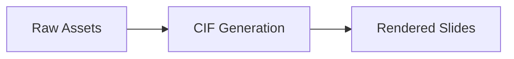
````

**Flowchart example — with decision:**
````markdown
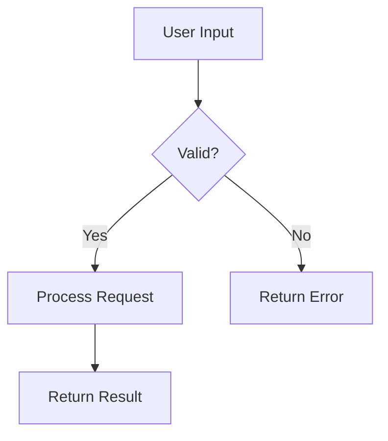
````

**Sequence diagram example:**
````markdown
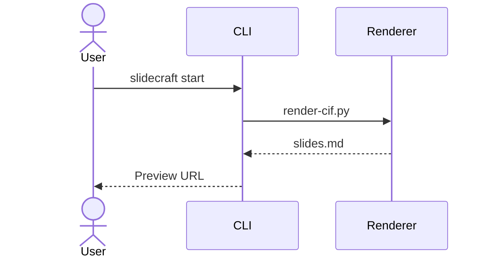
````

### 3b. Comparison → Markdown Table or Two-Cols

If the slide layout is already `two-cols`, keep it and add a clean markdown comparison table inside `col1` or `col2` if the content is sparse. If the layout is `default`, switch to `two-cols` and distribute the comparison content.

**Markdown comparison table example (inside a col slot):**
```markdown
| Criteria     | Option A | Option B |
|---|---|---|
| Setup time   | 2 days   | 1 day    |
| Cost / month | $200     | $350     |
| Flexibility  | High     | Medium   |
```

Maximum 5 rows (excluding header). If more rows exist, group minor items into an "Other" row.

For a `default` slide being switched to `two-cols`, populate `slots.col1` and `slots.col2` and clear `content`.

### 3c. Data → Mermaid Pie or XY Chart

Use `pie` for part-of-whole data (proportions that sum to ~100 %). Use `xychart-beta` for trend, bar, or comparison data across categories.

**Pie chart rules:**
- Maximum 6 slices. Merge small values into "Other" if more.
- Always include a chart title with `title "..."`.
- Values are raw numbers (Mermaid computes percentages).

**Pie chart example:**
````markdown
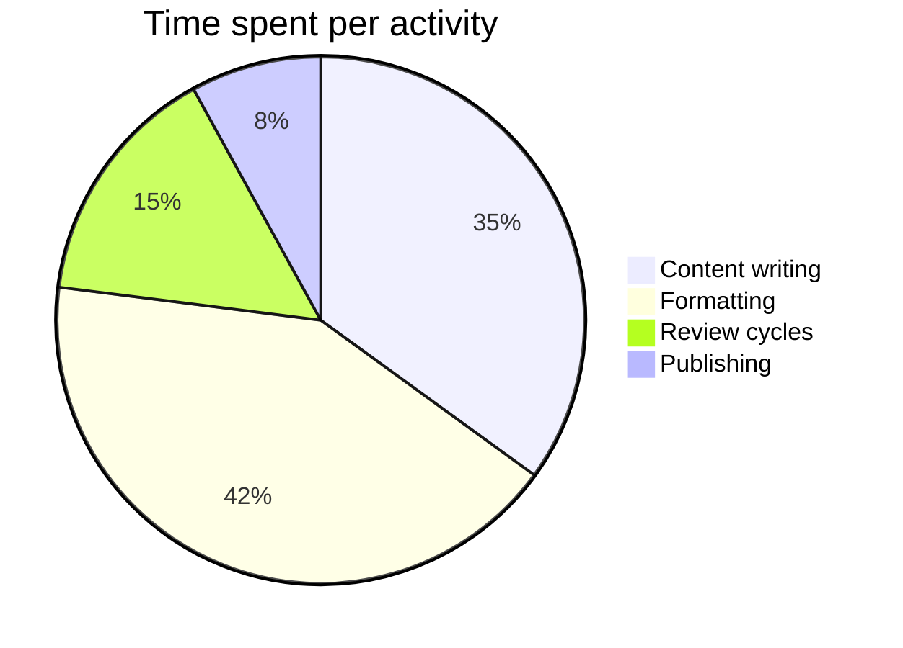
````

**XY chart example (bar):**
````markdown
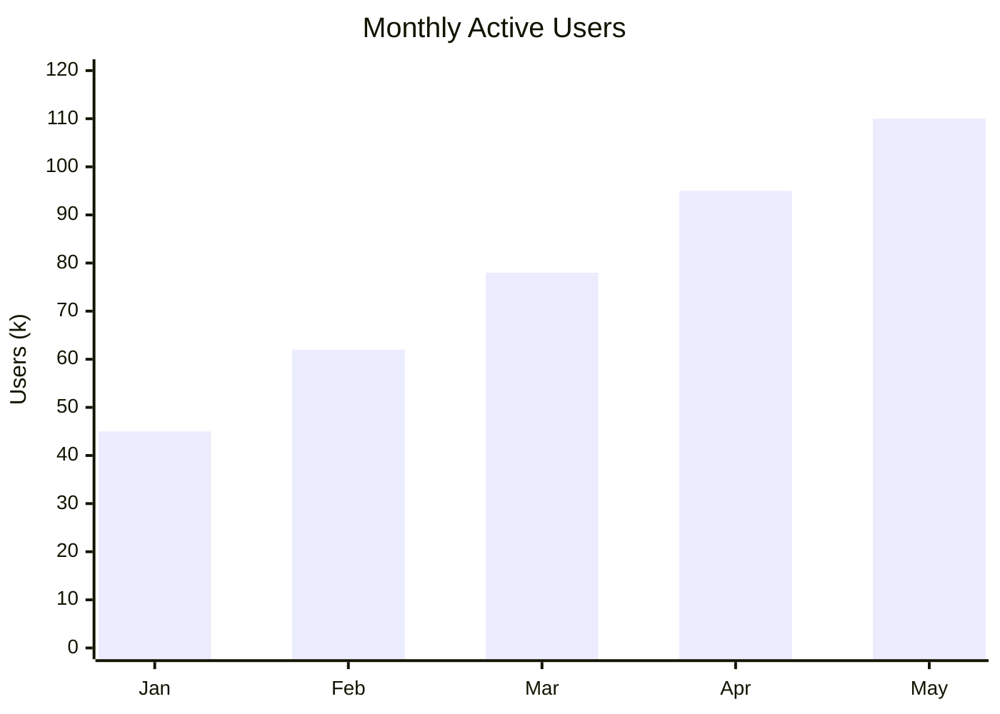
````

**XY chart example (line + bar):**
````markdown
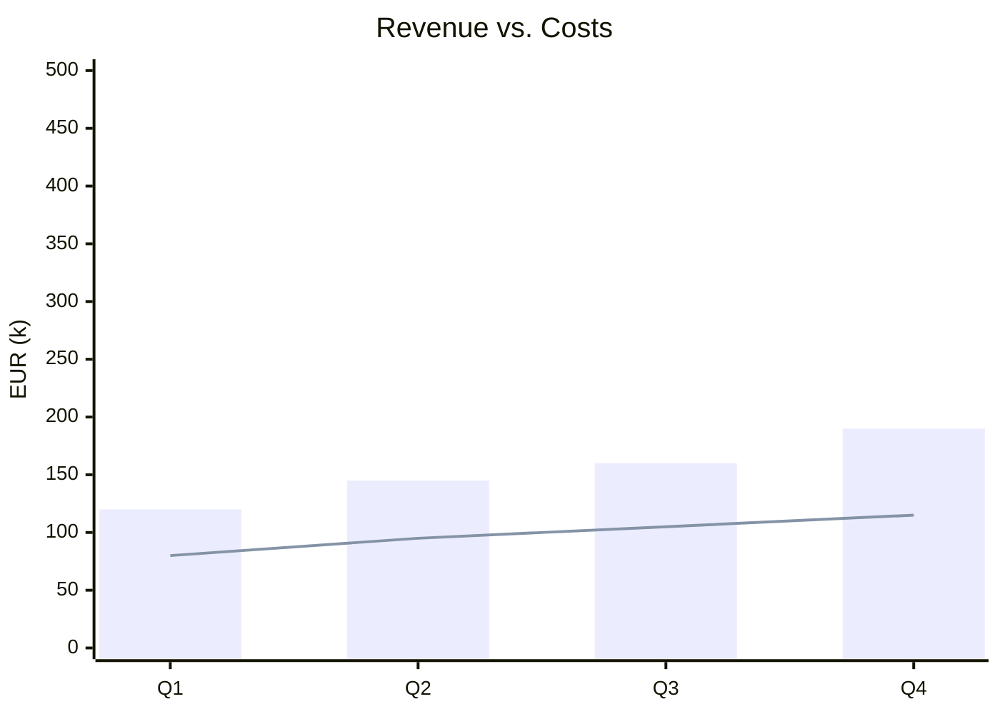
````

### 3d. Hierarchy → Mermaid Mindmap or Graph Tree

Use `mindmap` for concept maps with one root and radiating branches. Use `graph TD` for strict top-down org-chart style hierarchies.

**Mindmap rules:**
- Root node is at the top level (no indentation).
- First-level children use two-space indent.
- Second-level grandchildren use four-space indent.
- Maximum 9 leaf nodes total across all levels.
- Do not use parentheses or special punctuation in node labels inside mindmap (Mermaid parses them as shape modifiers).

**Mindmap example:**
````markdown
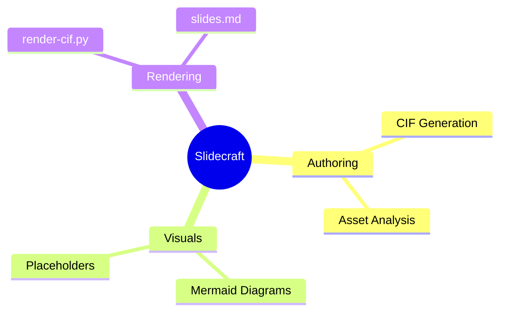
````

**Graph tree example (org chart):**
````markdown
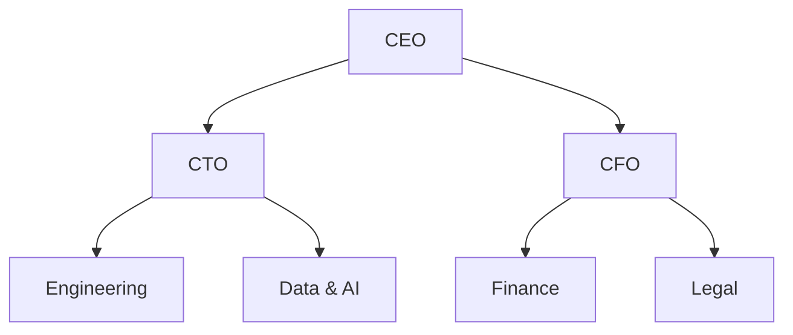
````

### 3e. Timeline → Mermaid Timeline or Gantt

Use `timeline` for high-level milestone overviews. Use `gantt` when tasks have explicit start/end dates and dependencies.

**Timeline rules:**
- Maximum 7 events.
- Group events under section headers when there are more than 4 events.
- Use plain language for event labels (no special characters).

**Timeline example:**
````markdown
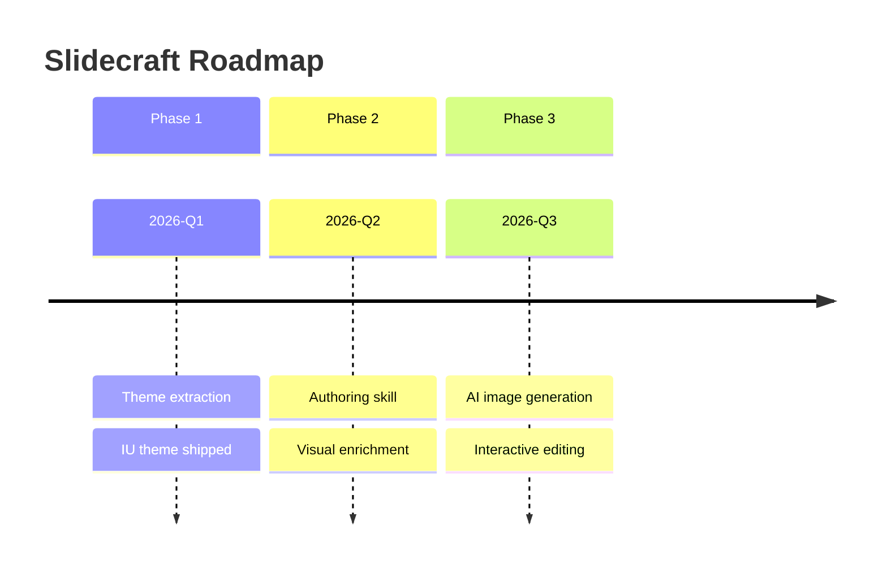
````

**Gantt example:**
````markdown
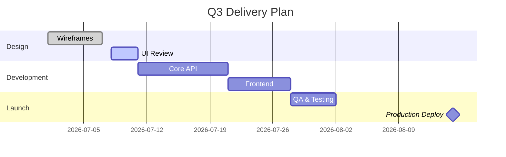
````

### 3f. Code → Fenced Code Block

Wrap all code examples in fenced blocks with a language identifier. Never use generic ` ```text ` — always specify the language.

**Supported language identifiers:** `bash`, `python`, `typescript`, `javascript`, `json`, `yaml`, `html`, `css`, `sql`, `markdown`.

**Rules:**
- Maximum 15 lines. If the original content has more, extract the most illustrative portion and add a comment noting the omission (e.g., `# ... full config in repo`).
- Preserve original indentation exactly.
- Do not add line numbers — Slidev handles those via its own shiki integration.

**Code block example:**
````markdown
```python
def render_cif(cif_path: str, output_path: str) -> None:
    with open(cif_path) as f:
        cif = json.load(f)
    slides_md = build_slides_md(cif)
    with open(output_path, "w") as f:
        f.write(slides_md)
```
````

### 3g. Concept → Image Placeholder

For abstract concepts that benefit from an illustration but have no data to chart, insert a placeholder comment that describes what an ideal image would show. Use HTML comment syntax so Slidev ignores it but the placeholder is visible in the source.

Format:
```markdown
<!-- IMAGE PLACEHOLDER: [Brief description of ideal visual — max 20 words]
     Suggested search terms: [3-5 keywords]
     Size: [full-width | half-width | icon]
     Alt text: [accessibility description] -->
```

**Example:**
```markdown
<!-- IMAGE PLACEHOLDER: Annotated before/after slide comparison showing assertion-evidence design principle
     Suggested search terms: slide design, assertion evidence, presentation structure
     Size: full-width
     Alt text: Two slides side by side — left shows topic label, right shows full assertion sentence -->
```

---

## Step 4 — Apply Cognitive-Load Limits

Before writing any visual to the CIF, check these hard limits. If a limit is exceeded, apply the specified remediation.

| Visual Type | Limit | Remediation if Exceeded |
|---|---|---|
| Mermaid flowchart / graph | Max 9 nodes | Group adjacent steps into a single composite node; note grouped items in speaker notes |
| Mermaid sequence diagram | Max 6 participants, max 12 messages | Split into two sequence diagrams on consecutive slides |
| Mermaid mindmap | Max 9 leaf nodes total | Collapse sibling leaves under a new parent node |
| Mermaid pie chart | Max 6 slices | Merge smallest slices into "Other" |
| Mermaid gantt | Max 12 tasks | Show only milestone tasks; move detail to speaker notes |
| Markdown table | Max 5 data rows (excl. header) | Merge minor rows or note that full table is in appendix |
| Code block | Max 15 lines | Truncate to key lines; add `# ... (truncated)` comment |
| XY chart categories | Max 8 on x-axis | Aggregate smallest categories |

When a split is required (two slides from one), create the second slide with the next available ID, copy the original layout and notes prefix, and note to the user that a new slide was added.

---

## Step 5 — Save History and Write the Updated CIF

### 5a. Save history

Before overwriting, copy the current CIF to the history folder:

```
.slidecraft/history/cif-YYYYMMDD-HHMMSS.json
```

Use the current date and time. Create the `history/` directory if it does not exist.

### 5b. Update each slide in the CIF

For each approved slide, update the CIF object as follows:

**For slides where visual goes into `content`** (single-column layouts like `default`, `fact`, `statement`, `side-note`):

Set `content` to the fenced Mermaid block, code block, table, or placeholder comment. If the slide already has text content, decide:
- If the text is the title restated → replace it with the visual.
- If the text provides context the visual cannot replace → prepend a brief (1–2 line) lead-in sentence, then the visual. Keep total body text under 40 words.

**For slides with `two-cols` layout:**
- Place the visual in `slots.col2` (right column) as a rule.
- Keep the original textual content in `slots.col1`.
- Exception: if the visual IS the comparison (e.g., a table), place it spanning both columns by putting it in `content` and clearing `slots`.

**For `concept` slides (image placeholder):**
- Append the HTML comment block after any existing `content`.
- Do not clear existing content.

**Layout change rule:** If a `default` slide with comparison content is being given a two-cols treatment, change its `layout` from `default` to `two-cols` and move its existing text to `slots.col1`.

### 5c. Add/update the `meta.visualEnriched` flag

In each modified slide's `meta` object, set:
```json
"visualEnriched": true
```

This lets other skills and agents know the slide has already been processed by visual-enrichment.

### 5d. Write the file

Write the updated object back to `.slidecraft/cif.json` with two-space indentation and UTF-8 encoding.

---

## Step 6 — Re-render

After writing the CIF, run the renderer to produce `slides.md`.

Read `.slidecraft.json` in the workspace root to find `pluginDir`, then run:

```bash
python <plugin-dir>/scripts/render-cif.py --input .slidecraft/cif.json --output slides.md
```

If the render fails (non-zero exit code or stderr output), report the error verbatim, revert `.slidecraft/cif.json` from the history copy, and do not leave a broken `slides.md`.

After a successful render, present a summary:

```
Visual Enrichment Complete
==========================

Modified slides : 5
New slides added: 1 (slide-08b split from slide-08)
Skipped slides  : 4 (cover, section, end, quote)

Changes:
  slide-03  data      → Mermaid pie chart (4 slices)
  slide-04  comparison→ two-cols retained; markdown table added to col2
  slide-05  process   → Mermaid flowchart LR (3 nodes)
  slide-06  hierarchy → Mermaid mindmap (7 leaf nodes)
  slide-07  timeline  → Mermaid timeline (5 milestones)
  slide-08  code      → bash fenced block (8 lines)
  slide-09  concept   → Image placeholder added

CIF saved to .slidecraft/cif.json
History copy: .slidecraft/history/cif-20260518-143200.json
slides.md re-rendered successfully.
```

---

## IU Theme Mermaid Configuration

The IU theme should include a `setup/mermaid.ts` file that configures Mermaid with IU brand colors. If it does not exist, note it to the user and suggest creating it:

```typescript
import { defineMermaidSetup } from '@slidev/types'
export default defineMermaidSetup(() => ({
  theme: 'base',
  themeVariables: {
    primaryColor: '#0BF000',
    primaryTextColor: '#1D1D1F',
    primaryBorderColor: '#575E62',
    lineColor: '#575E62',
    secondaryColor: '#E0E0E3',
    tertiaryColor: '#FFFFFF',
    fontFamily: 'Source Sans 3, Source Sans Pro, system-ui, sans-serif',
  },
}))
```

This file lives at `<themePath>/setup/mermaid.ts` relative to the workspace root. Without it, Mermaid diagrams render in the default blue theme, which clashes with IU brand colors.

---

## Mermaid in Slidev — Technical Notes

In `slides.md`, Mermaid diagrams render from standard fenced code blocks:

````markdown
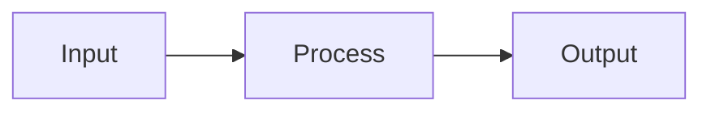
````

In the CIF `content` or slot fields, store the fenced block as a plain string, including the opening and closing backtick lines. Example JSON value:

```json
"content": "```mermaid\nflowchart LR\n  A[Input] --> B[Process] --> C[Output]\n```"
```

The renderer (`render-cif.py`) passes content strings through verbatim, so the fences must be present in the CIF.

**Common Mermaid syntax errors to avoid:**
- Do not use colons in node labels inside `flowchart` — they conflict with the link label syntax. Use em-dash (`—`) or reword.
- In `mindmap`, do not use `()` or `[]` in leaf labels — they are interpreted as shape modifiers.
- In `gantt`, `dateFormat` must appear before any task definitions.
- In `timeline`, section headers must not start with a number.
- In `pie`, values must be positive numbers with no % sign.
- All diagram types are case-sensitive (`flowchart` not `Flowchart`).

---

## Key Rules (Always Follow)

- **Never edit `slides.md` directly.** All changes go through the CIF.
- **Always save to history before overwriting the CIF.**
- **Never propose a visual for skip-layout slides** (`cover`, `section`, `section-gray`, `end`, `divider`, `accent`).
- **Never exceed cognitive-load limits.** Apply the specified remediations rather than violating the limits.
- **Always present the proposal table and wait for user approval before generating any visual content.**
- **A visual must add information, not decorate.** If the best visual for a slide would merely restate the text, classify the slide as `narrative` and skip it.
- **Speaker notes must be updated** on any slide whose content changes — note what the diagram shows and what the presenter should highlight.
- **Read `references/best-practices.md`** at the start and apply its one-idea-per-slide rule: if adding a visual requires removing body text to stay under the 40-word limit, move the removed text to speaker notes.
